Running AIMMS models in Windows
=======================================

Setting up for the first time
-----------
AIMMS models such as MOTOR and OPERA run on a server at TU Delft. In order to use this, one needs to have a NetID from TU Delft. After that, one should install and use eduVPN.
It can be installed using the following link: https://tudelft.eduvpn.nl/portal/home.
After installing eduVPN, one should connect it to Delft University using their NetID. After this step, one can go to https://weblogin.tudelft.nl/.
After logging in, one should be able to see the following screen:

Note that in below everything is written for MOTOR, but it would be similar for other
AIMMS models.

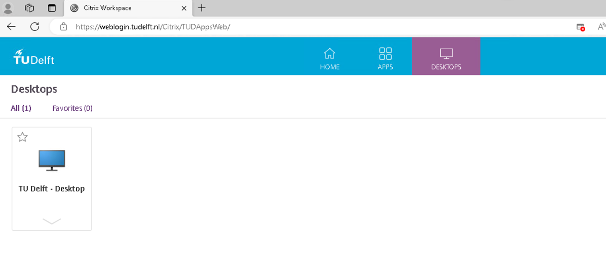

Click on 'Desktops' and 'TU Delft - Desktop' and log in. Now you are in the TU Delft environment. 
In this environment, it is possible to send emails/teams and start requests.
Mail: https://webmail.tudelft.nl
Service Desk: https://tudelft.topdesk.net/
Service email: servicepunt@tudelft.nl

To use the srv356.tudelft.net server, which is used by the MOTER adapter,
one needs a SUP account (with admin rights). Currently, we use the following SUP account: DASTUD\\sup-harmendijkstra.
You can access this server by navigating to https://weblogin.tudelft.nl/ within the TU Delft desktop.
This time, click on 'Apps'/'Remote Desktop Connection,' and enter the username and credentials of the SUP account (for example: DASTUD\\sup-harmendijkstra).

Some usefull paths on the TU-Delft server
-----------
Python code:
D:\\MOTER\\moter-adapter\\tno\\aimms_adapter

AIMMS program location:
C:\\AIMMS

MOTER current version (used by the adapter):
C:\\Models\\MOTER
MOTER service used by orchestrator:
D:\\moter_service

How to run the adapter code without using using the orchestrator
-----------
**Step 1:** Stop the MOTER service
In order to use the MOTER code manually, we need to stop the MOTER service that is used by the orchestrator since they both use the same port to run on. Therefore, search for 'services':

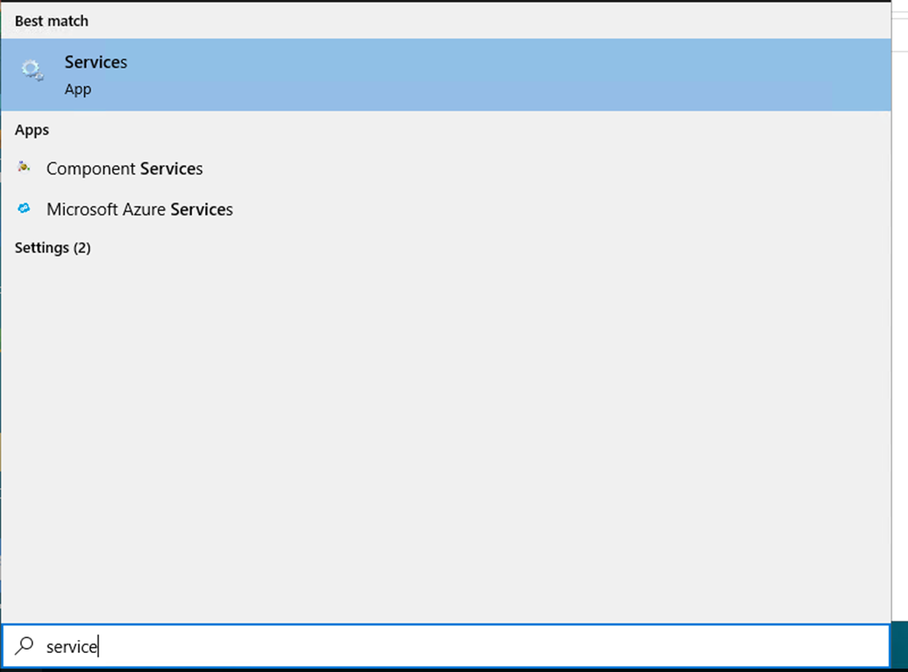

Then search for MMviB MOTER service:

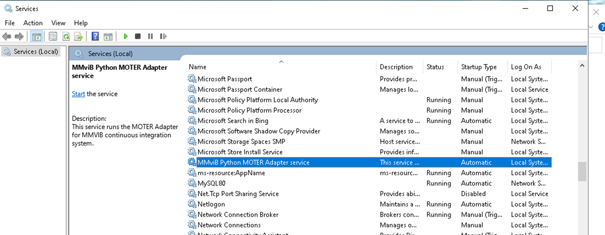

Make sure to stop this service by right-clicking and selecting 'Stop.'

**Step 2:** Use Visual Studio Code and navigate to MOTER\\moter-adapter.
Type in 'Visual Studio Code.' Within this application, click on 'File' \> 'Open Folder...' Then, navigate to MOTER\\moter-adapter: 

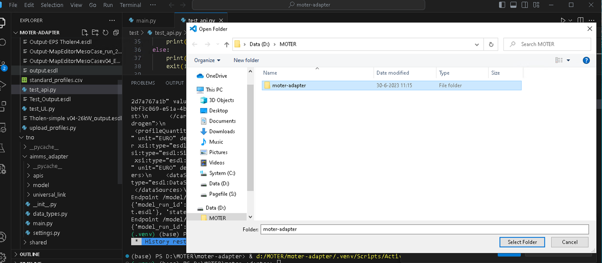

**Step 3:** Make sure to use the right python environment 
Click on ‘Terminal’, it should look like:

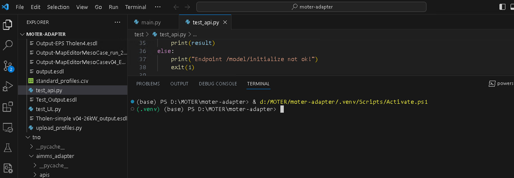

Make sure that we are using the correct Python environment called '.venv,' which is highlighted in green letters in the above picture. If this is not the case, use 'Ctrl + Shift + P' and search for 'Python: Select Interpreter:

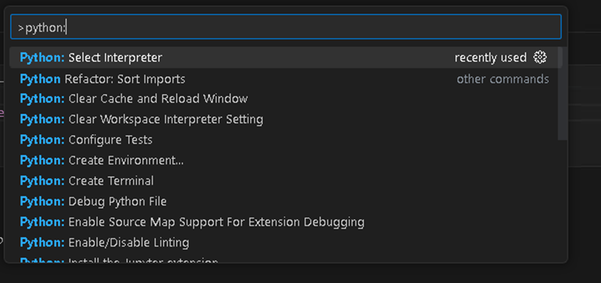

After this it should be possible to select …… (‘.venv’:.venv):

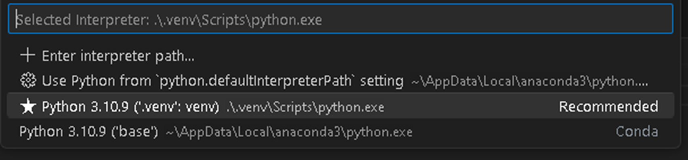

After the above steps, the '.venv' environment should be activated every time you open a new terminal. If this is not the case, you can also type in the following command in the terminal: '..venv\Scripts\Activate.bat.'

**Step 4:** Running the MOTER application manually
To run the MOTER application, you can enter the following command in a new terminal: 'python .\\tno\\aimms_adapter\\main.py':

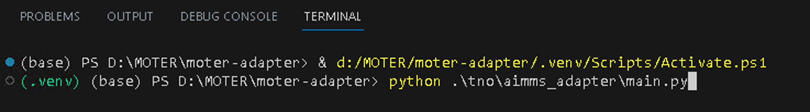

The (MOTER) adapter should now be running manually:

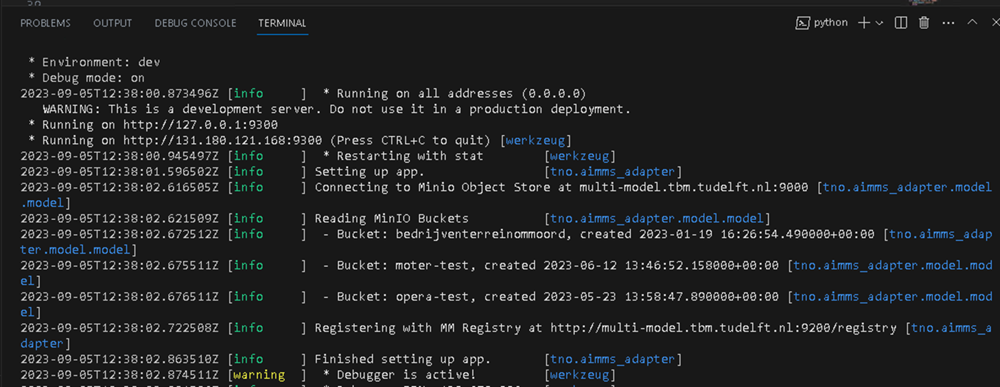

**Step 5:** Run a test script:
You can open a new terminal by clicking on the + sign (or arrow down if you prefer another type of terminal that is not standard, such as PowerShell, Python, or Command Line, based on your preference):

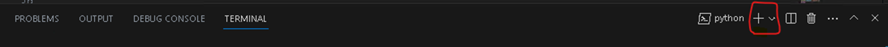

In this new terminal, also ensure that the .venv Python environment is active. Make sure not to close the MOTER adapter running in the other terminal, which can be accessed by clicking on it on the right. Now, type the following command in this new terminal: 'python .\\test\\test_api.py':

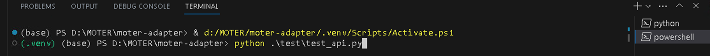

The test script should now be running, which tests several API endpoints. Some of them involve copying the input ESDL to MOTER, running MOTER, and writing the output back to an output ESDL. It should generate an output in the terminal with extensive information about the API endpoints. 

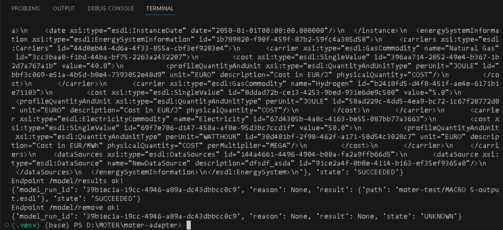

In the above example, you can already see the ESDL in the terminal.

**Step 6:** After you are done, make sure to start the MOTER service again!
Once you have completed your tasks on the TU Delft server, please start the MOTER service again so that it is available for the orchestrator. You can do this by following similar steps as in Step 1, but this time, right-click and select 'Start.' Make sure to check that the service is indeed now running.

.. figure:: images/13_running_service.png
   :width: 800
   :alt: Check server is running

As you can see in the above, the status is now 'Running.'

**Step 7:** Disconnect from the server
Once you have finished with the server, please ensure that you always disconnect and never shut down the server.

Use different ESDL files
-----------
To use a different input and output ESDL, you need to follow these steps:
**Step 1:** Add ESDL to Minio
Navigate to 'multi-model.tbm.tudelft.nl:9000' and log in. Click on 'moter-test' in the object browser:

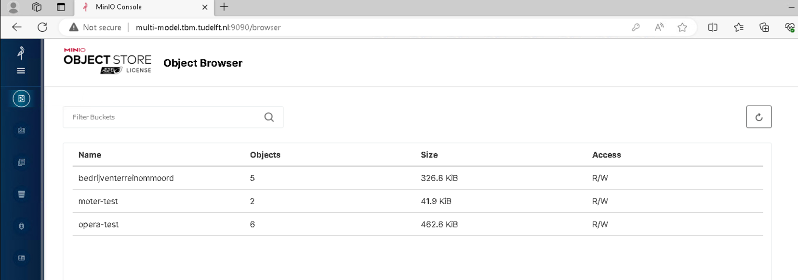

Click on 'Upload' and upload the ESDL files. Note: you only need to upload the input ESDL file. The output ESDL file will be created by the tool.

**Step 2:** Change the ESDL name in the test script
In Visual Studio Code, go to the file: test/test_api.py:

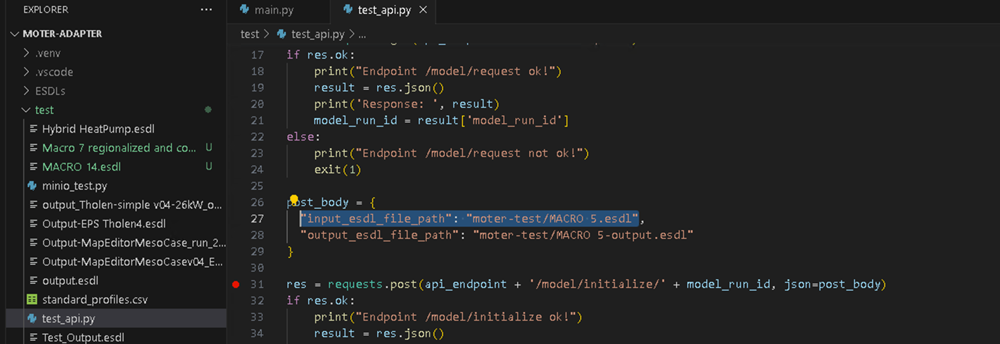

As seen in the picture above, you can change the path to the ESDL file here. This path corresponds to the location in Minio. Therefore, we are using the 'moter-test' bucket. After that, specify the name of the ESDL file. This latter part can be updated with the newly added ESDL name in Minio.

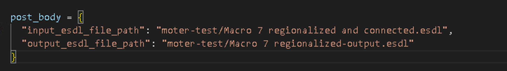

Ensure that you also change the output path to prevent overwriting an existing file. Make sure to save this test file after making these changes.

**Step 3:** Follow the steps in 'How to run the MOTER code without using the orchestrator.'
Now, run the MOTER script manually by following all these steps.

**Step 4:** Download the output from Minio
After completing the above steps, you can download the output ESDL using similar steps as in Step 1. Navigate to Minio and click on the file you want to download. It should have created a new file in Minio:

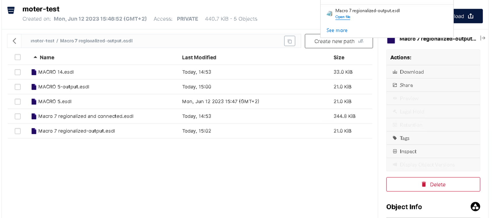

Create a new service in the TU-Delft server
-----------
To create a new adapter in TU Delft, it is necessary to create a new Windows service; otherwise, the adapter won't be visible to the orchestrator. Python processes will be terminated when you disconnect. Therefore, we have created a MOTER service:

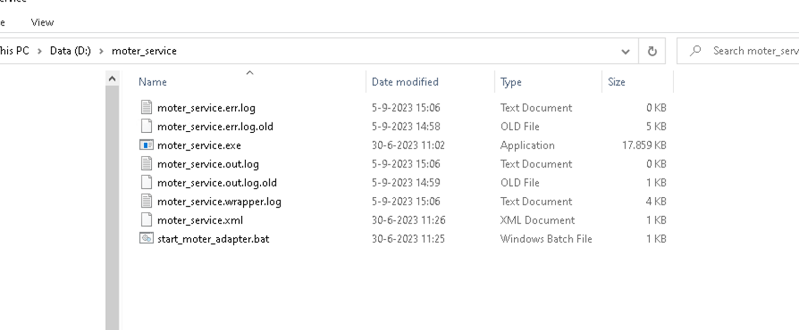

This service is the service that needs to be stopped/started in the steps described in other parts of this document. Therefore, one can create a .bat file similar to the one below::
    D:
    call D:\MOTER\moter-adapter\.venv\Scripts\activate.bat
    cd D:\MOTER\moter-adapter
    set PYTHONPATH=D:\MOTER\moter-adapter
    python.exe tno\aimms_adapter\main.py
    REM pause

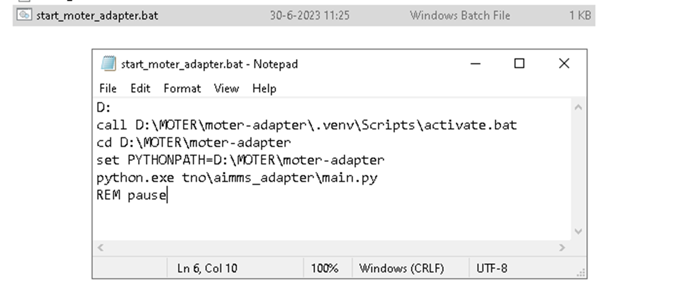

After the creation of this .bat file. One can create a service with this using WinSW:
https://github.com/winsw/winsw
Following these steps, we used the following moter_service.xml::
    <service>
      <id>PythonMOTERAdapterService</id>
      <name>MMviB Python MOTER Adapter service</name>
      <description>This service runs the MOTER Adapter for MMVIB continuous integration system.</description>
      <env name="PYTHONPATH" value="D:\MOTER\moter-adapter"/>
      <workingdirectory>D:\Moter\MOTER-adapter</workingdirectory>
      <startmode>Automatic</startmode>
      <interactive/>
      <executable>D:\moter_service\start_moter_adapter.bat</executable>
      <log mode="roll"></log>
    </service>
