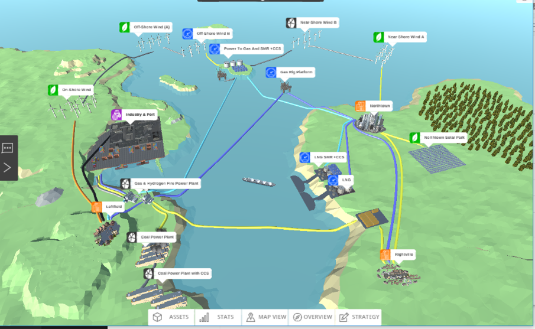
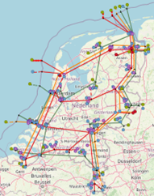
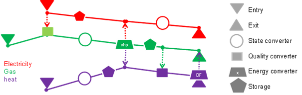

MOTER (Modeler of Three Energy Regimes)
=======================================

MOTER is an optimization tool for the dispatch of 'multi-commodity' energy systems consisting of interconnected
electricity, natural gas, hydrogen and heat networks. MOTER was developed in the period 2015-2020 DNV as the calculation
engine for the DNV 'Energy Transition Simulator' (ETS). The ETS allows for 10-15 participants in a workshop setting to
explore decarbonization pathways, from 2020 to 2050, for a simple fictive world ('Enerland'), but with real world
techno-economic physics and price models. As the physics engine, MOTER dispatches all production, end use, transport,
conversion and storage assets of Enerland energy system at lowest overall cost. The objective of MOTER within the
Multi-Model macro case is to add network dispatch and in particular network congestion management to a the national
'II3050-Mobility' case.

   The original Enerland case in the Energy Transition Simulator.

   the Netherlands-II3050-Mobility network template in the MultiModel

MOTER scope
-----------
The objective of MOTER (Modeler of Three Energy Regimes) is to find the optimal techno-economic performance of an
externally provided multi-commodity energy system, consisting of the topology and capacities of following assets:

-	Primary energy generation via wind turbines, solar PV, geothermal, coal power plants (+CCS), natural gas production and energy import/ export.
-	Residential, industrial heat &power demand centers via 'smart' end use applications.
-	Energy conversion via gas-to-power, power-to-gas, power-to-heat, gas-to-heat, natural gas to hydrogen technologies.
-	Energy transport networks consisting of power cables, gas pipelines, heat networks (+ transformers, compressors)
-	Energy storages (battery, pumped hydro, underground gas storage, insulated hot water tanks)

The output of MOTER is the cost optimal 'dispatch' of the flex in the energy system. The term 'flex' refers to any 
measure the market can take to reduce supply-demand imbalances, such as:

-	Bridging energy supply-demand imbalances in space using passive assets (pipes and cables) in combination with dispatchable assets (compressors and transformers)
-	Bridging energy supply-demand imbalances in time using storage.
-	Bridging energy supply-demand imbalances in energy type using conversion.

Additional 'flex' options:

-	Production flex: Ramp-up of flexible sources (natural gas, oil import etc.), curtailment of fixed sources (solar PV, wind turbines, geothermal, etc) according to relative merit orders.
-	End user flex: Curtailment and time shifting of energy end use according to relative merit orders (industrial/ residential v. electric power/ space heating).
-	Conversion flex: multi-fuel operations (heat pump+ natural gas back up)

   Illustration of a multi-commodity energy system in MOTER. Energy carriers enter the system via network 'entries'
   (producers) and leave via network 'exits' (consumers). To match supply -demand, energy carriers can transported via
   cables pipes and stored in storages. Energy carriers can be converted from carrier A -> B via (energy) converters
   (boilers, electrolyzers, steam methane reformers), Energy 'states' (voltage, prerssure) can be altered using (state)
   converters like compression/ transformers. The 'quality' of the energy (mainly  gas calorific value, heat network
   water temperature) can be changes via (quality) converters like natural gas to hydrogen converters, gas mixing
   stations and back-up heaters. MOTER does not yet model AC power 'cos phi' or reactive power.

Energy carriers in scope are:

.. list-table::
   :header-rows: 1

   * - Energy carriers
     - Subtypes
     - Modeled properties
   * - electricity
     - HV, MV, LV
     - Voltage, current (DC eq.), power
   * - EGaseous
     - Natural gas , biogas, hydrogen
     - Pressure, flow, Calorific value, power
   * - Heated water
     - Heat network, local demand
     - Pressure, flow, temperature, power
   * - External fuels
     - Oil, coal, nuclear
     - Flow, Calorific value, power

The assets in scope are:

.. list-table::
   :header-rows: 1

   * - Type
     - Examples
     - Input parameters
     - Output
   * - Production/entries
     - Wind turbine, gas field, geothermal, oil import
     - Capacity, curtailment / import cost, requested profile
     - Operational hours, realized profile
   * - End use/ exits
     - Industrial/ residential, Heat/ power, mobility
     - Capacity, curtailment / export cost, requested profile
     - Operational hours, realized profile
   * - Converter (carrier)
     - Gas-to-power, power-to-gas, gas-to-heat, power-to-heat, natural gas to hydrogen
     - Capacity, efficiency
     - Operational hours, realized profile
   * - Converter (transport)
     - Transformer, compressor
     - Capacity, efficiency
     - Operational hours, realized profile
   * - Converter (quality)
     - Gas blending, heat booster
     - Capacity, efficiency
     - Operational hours, realized profile
   * - Transport
     - Cable, pipe
     - Length, conductivity
     - Operational hours, realized profile
   * - Storage
     - Battery, salt cavern, hot water tank
     - Volume, send-in/out capacity
     - Operational hours, realized profile

Special feature: time slices
----------------------------
A special challenge when working with optimization modeling is the maximum number of assets that can be modelled in
combination with properties and time resolution. In other words, the size of the 'objects(variables,T) matrix' that
will still fit into computer memory and can be solved in acceptable calculation. Macro Energy modelling requires that 
both the seasonal and the intraday dynamics must be captured by the model. However modeling 8760 hours/year will 'blow 
up' memory usage and severely restricts the number of active objects (distributed and connected in space and including 
subcategories) that it becomes unsuitability for real world applications. This especially when Monte Carlo methods 
('perform a great number of runs with stochastically varied inputs') are being considered and model runs need to be 
(very) fast. The solution in MOTER, as is used for Opera, is to reduce the 8760 hours to a define a subset of 'time 
slices' during the year. This because a series of 8760 hours will contain a significant amount of redundant information.
In one case study and it was established that with only 16 snapshots (night/morning/afternoon/ evening & winter, spring,
summer, autumn) sufficient accuracy (~>90%) may already be achieved, in only a fraction ( <1%) of the calculation time. 
In order to create a 8760 hour profile from the snap shots a simple 'sample & hold'  reconstruction algorithm is used.

Note that when using 'global optimization', special care has been taken is that the relative order of the snapshots, 
i.e. causality, is being respected. This because global optimizers calculate all time steps all at once, unlike 
simulators which run though time step consequently. MOTER has extra time hierarchy information on first priority on the
intraday snapshot order first (night, morning, afternoon, evening) and then the days ordering during the year next (jan
1st –> December 31st). This 'proper time ordering' is important when optimizing energy storage systems that perform both
intraday and seasonal balancing functions.

   Example of defining the time slices that serve as 'proxies' for the reconstruction of full year dynamics.

For more information see `Netbeheer Nederland datasheet about MOTER <https://www.netbeheernederland.nl/_upload/Files/Rekenmodellen_21_dd7baea363.pdf>`_