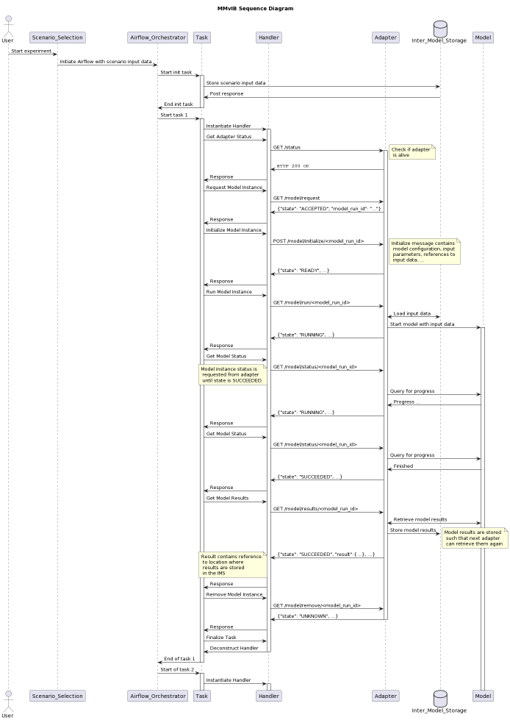

Model adapters
==============

General principles
------------------
- Model adapters act as the interface between the orchestrator and the models
- Model adapters make every model accessible in the same way
- Model adapters all have the same (generic) API which makes it a lot easier at the orchestrator side
- Model adapters are responsible for preprocessing of input data and postprocessing of output data

Model adapter interaction
-------------------------
The following picture shows the interaction between the handler (inside Airflow), the adapter and the model.

Model adapter REST API
----------------------
Every adapter should implement the following endpoints:

-	GET /request

  o	Description:
     The lifecycle is started by the model handler with the /request message, that can be used at the adapter side to set things up and reserve resources for this specific model run.
  o	Returns:
     model_run_id: a unique identifier generated by the adapter which the handler can later use to refer to this model run
     state: ACCEPTED, PENDING, QUEUED, ERROR
     reason: description in case of state ERROR

-	POST /initialize/<model_run_id>

  o	Description:
     Call to initialize the model
  o	Body contents:
     JSON containing model specific configuration parameters, settings, input values, references to file locations, …
  o	Returns:
     model_run_id
     state: READY, ERROR
     reason: description in case of state ERROR

-	GET /run/<model_run_id>

  o	Description:
     Call to start the model run
  o	Returns:
     model_run_id
     state: RUNNING, …, ERROR
     reason: description in case of state ERROR

-	GET /status/<model_run_id>

  o Description:
     Call to retrieve the status of the model
  o Returns:
     model_run_id
     state: ACCEPTED, PENDING, QUEUED, RUNNING, SUCCEEDED, ERROR
     reason: description in case of state ERROR

-	GET /results/<model_run_id>

  o Description:
     Call to retrieve the results from the model run
  o Returns:
     model_run_id
     result: JSON with results from the model
     state: READY, ERROR
     reason: description in case of state ERROR

GET /remove/<model_run_id>

  o Description:
     Call to free all reserved resources, clean memory. After this call, the orchestrator will not call for information again
  o Returns:
     model_run_id
     state: UNKNOWN (initial state), ERROR
     reason: description in case of state ERROR
