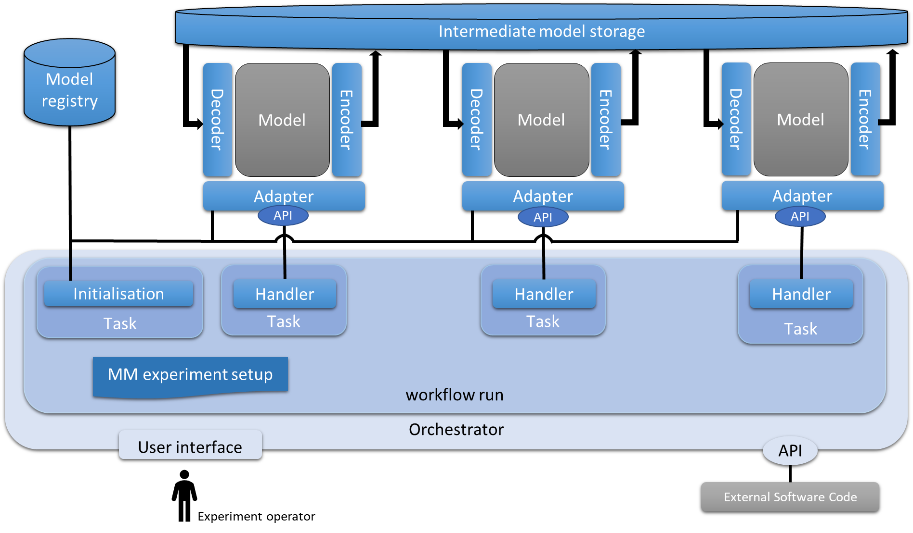

Technical Documentation
=======================

General concepts
----------------
- A model doesn't know and doesnt' need to know that it's part of a multi model
- A model doesn't need to be open (source) to become part of a multi model
- An external software component will take care of the right order of model execution
- Data exchange between models is standardized

The IT architecture
-------------------

The following IT architecture has been developed in the project:

The architecture consists of the following components:

- the orchestrator: The orchestrator takes care of orchestrating a workflow in which multiple models are executed in a particular order
- models: The models perform the real calculations that are required to answer a certain question
- model adapters: The model adapters make sure the orchestrator can control the models
- model registry: The model registry keeps track of which model (adapters) are there and enables the orchestrator to find a model
- intermediate model storage: The intermediate model storage is used to store data that goes into a model or comes out of a model. This can be an intermediate or final result.

Orchestrator
............
The orchestrator is a generic software component that can be configured to execute tasks in a certain order.

Model Registry
..............
The model registry is a small database that is used to keep track of which model adapters are present and what
capabilities they have. When a model adapter is started, it registers itself with the model registry specifying how the
adapter can be reached and what its capabilities are (for example if the model allows concurrent execution). The
model registry is used by the orchestrator to find out where to find the relevant models for the current multi model
workflow execution.

Model Adapters
..............
Model adapters provide a generic interface for the orchestrator to communicate with a model. The adapter is responsible
for collecting the right input data (by loading it from the intermediate model storage), orchestrating the model
execution and collecting the output data from the model and making it available for the next model (by storing it in the
intermediate model storage).

Intermediate model storage
..........................
The intermediate model storage provides storage for input and output data of the models. The orchestrator configuration
determines how and where the input data and output data is stored. The adapters are responsible for loading and saving
data to and from the intermediate model storage

Software components
-------------------
The following software has been selected for the implementation of the multi modeling platform:

- orchestrator: `Apache Airflow <https://airflow.apache.org/>`_, a platform to programmatically author, schedule and monitor workflows
- model registry: specifically developed for this purpose
- model adapters: specifically developed for this purpose
- intermediate model storage: `Minio <https://min.io/>`_, an open source S3 compatible object store

See the :ref:`Installation instructions` for more details.